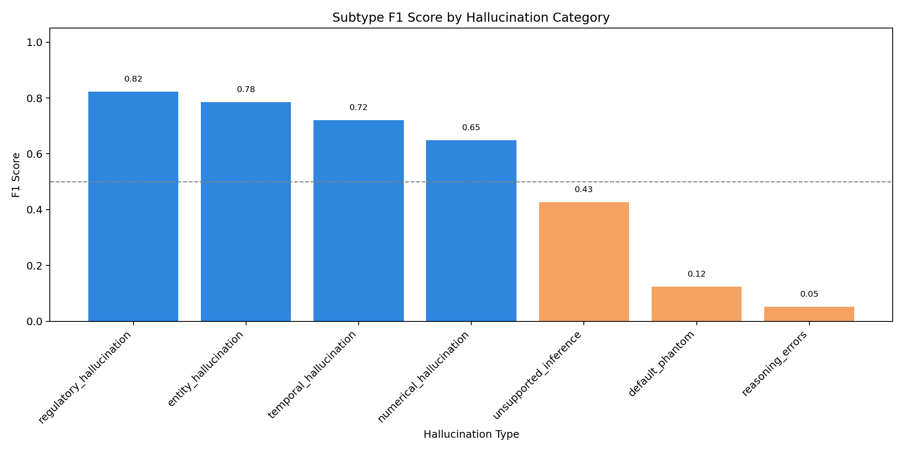

# Hallucination Detector Accuracy Report

## Overview
This report summarizes the evaluation of the hallucination detection pipeline built for the generated hallucination dataset. The detector follows a one-vs-rest decision flow:

1. Decide whether the generated answer is a hallucination.
2. If yes, assign the most specific hallucination subtype.

The final evaluation was run on the combined predictions dataset after chunked batch processing and aggregation.

## Dataset and Setup
- Dataset: generated_hallucinations_10k_pool_verified.csv
- Rows evaluated: 4086
- Model used: gpt-5.5 via the OpenAI Responses API
- Output files:
  - combined_predictions.csv
  - accuracy_summary.csv
  - accuracy_summary.txt
  - subtype_metrics_by_category.csv
  - subtype_metrics_by_category.png

## Evaluation Metrics

| Metric | Value | Interpretation |
| --- | ---: | --- |
| Rows evaluated | 4086 | Total examples assessed |
| Binary accuracy | 0.8023 | Accuracy for hallucination vs non-hallucination classification |
| Subtype accuracy | 0.4471 | Accuracy for hallucination subtype assignment among true hallucination rows |

## Detector Column Definitions

### hallucination_detector
- This is the label for the main binary decision.
- It answers: “Is this answer a hallucination or not?”
- Typical values:
  - non_hallucination
  - entity_hallucination
  - numerical_hallucination
  - reasoning_errors
  - etc.
- In practice, it is the model’s chosen label after the one-vs-rest prompt, not just a true/false flag.

### hallucination_detector_is_hallucination
- This is the boolean companion to the first one.
- It answers: “True or false: is there a hallucination?”
- Typical values:
  - True
  - False

### hallucination_detector_type
- This is the subtype label only when the answer is considered a hallucination.
- If the detector says it is not a hallucination, this usually becomes non_hallucination.
- It is the more specific category label, such as:
  - entity_hallucination
  - numerical_hallucination
  - temporal_hallucination
  - reasoning_errors

### In simple terms
- hallucination_detector = overall label
- hallucination_detector_type = subtype/category label
- hallucination_detector_is_hallucination = yes/no flag

## Subtype Accuracy by Category
The overall subtype accuracy of 0.4471 is computed only on rows where the true label is a hallucination. It measures how often the predicted subtype exactly matches the true subtype for those rows.

### Per-category evidence table

| Category | Support | Predicted | TP | Precision | Recall | F1 |
| --- | ---: | ---: | ---: | ---: | ---: | ---: |
| unsupported_inference | 454 | 746 | 256 | 0.3432 | 0.5639 | 0.4267 |
| reasoning_hallucination | 453 | 2 | 0 | 0.0000 | 0.0000 | NaN |
| regulatory_hallucination | 452 | 577 | 423 | 0.7331 | 0.9358 | 0.8222 |
| temporal_hallucination | 441 | 498 | 338 | 0.6787 | 0.7664 | 0.7199 |
| numerical_hallucination | 400 | 614 | 329 | 0.5358 | 0.8225 | 0.6489 |
| reasoning_errors | 400 | 20 | 11 | 0.5500 | 0.0275 | 0.0524 |
| instruction_drift | 396 | 0 | 0 | NaN | 0.0000 | NaN |
| entity_hallucination | 358 | 282 | 251 | 0.8901 | 0.7011 | 0.7844 |
| default_phantom | 301 | 118 | 26 | 0.2203 | 0.0864 | 0.1241 |

### Interpretation of subtype results
- Strongest categories:
  - regulatory_hallucination: F1 = 0.8222
  - entity_hallucination: F1 = 0.7844
  - temporal_hallucination: F1 = 0.7199
  - numerical_hallucination: F1 = 0.6489
- Weakest categories:
  - reasoning_hallucination: F1 = 0.0000
  - default_phantom: F1 = 0.1241
  - reasoning_errors: F1 = 0.0524
  - instruction_drift: F1 = 0.0000

This explains the overall subtype score. The model is much better at identifying some categories than others, and several rare or semantically overlapping subtypes are being confused or missed.

## Visual Evidence

The chart above shows the F1 score by subtype. Higher values indicate better subtype detection quality. The curve clearly shows that regulatory, entity, temporal, and numerical hallucination types are handled much more reliably than reasoning-related and default categories.

## Interpretation
- The detector performs reasonably well for the binary classification task, correctly identifying whether an answer is hallucinated in about 80.2% of cases.
- The subtype prediction task is more difficult, with a subtype accuracy of 44.7%, indicating that the model is less reliable when it must choose among specific hallucination types.
- This pattern is common in multi-class NLP tasks where the binary decision is easier than the fine-grained label assignment.
- The category-level evidence shows that the model is good at some classes but unreliable for others, especially reasoning-heavy or ambiguous categories.

## Method Summary
- The input rows were processed in 10 resumable batch files.
- Each batch was scored using a prompt that required a JSON output with:
  - is_hallucination
  - label
  - reasoning
- The batch outputs were merged into a single combined prediction file.
- Accuracy was computed by comparing the detector output against the ground-truth labels in the dataset.
- Per-category metrics were computed to provide finer-grained evidence beyond the aggregate score.

## Final Conclusion
The pipeline shows promising performance for detecting whether a response is hallucinated, but subtype classification still needs improvement before it can be considered highly reliable for production use. The per-category evidence makes the limitation clear: some hallucination types are predicted accurately, while others are systematically under-detected or confused. Further tuning of the prompt, label definitions, or model configuration should focus on the weak subtype classes to raise the overall subtype accuracy beyond 0.4471.
