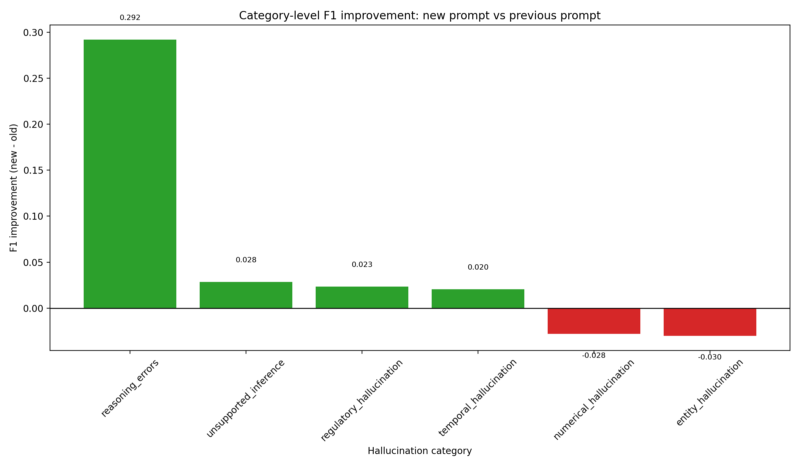
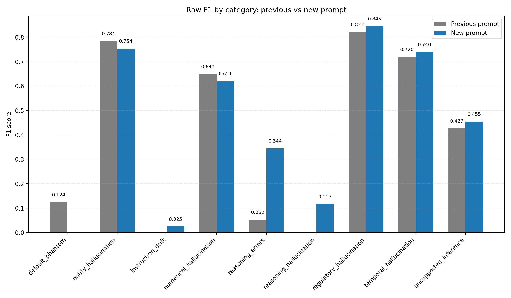

# Accuracy Comparison: Previous Prompt vs New Prompt

## Overview
This report compares the previous hallucination detector prompt against the revised prompt used in the current run.

### Comparison files
- Previous: `combined_predictions.csv`
- New: `combined_predictions_v1.csv`

## Aggregate metrics

| Metric | Previous | New | Improvement |
| --- | ---: | ---: | ---: |
| Binary accuracy | 0.8023 | 0.9168 | +0.1145 |
| Subtype accuracy | 0.4471 | 0.5010 | +0.0539 |

## Interpretation
- The new prompt improved binary hallucination detection from 0.8023 to 0.9168, a gain of 0.1145 absolute points.
- The new prompt improved subtype prediction accuracy from 0.4471 to 0.5010, a gain of 0.0539 absolute points.
- This suggests the updated decision rules and hierarchical prompt improved both the binary detection and the fine-grained subtype assignment, though the subtype task remains the harder problem.

## Category-level F1 improvement
The chart below shows the change in F1 score by category between the old and new prompts.

### Raw F1 comparison: previous vs new prompt
This second chart shows the actual raw F1 values for each category, rather than only the delta, so the absolute performance of each model is visible at a glance.

| Category | Old F1 | New F1 | Improvement |
| --- | ---: | ---: | ---: |
| reasoning_errors | 0.0524 | 0.3444 | +0.2921 |
| unsupported_inference | 0.4267 | 0.4551 | +0.0284 |
| regulatory_hallucination | 0.8222 | 0.8454 | +0.0233 |
| temporal_hallucination | 0.7199 | 0.7403 | +0.0204 |
| numerical_hallucination | 0.6489 | 0.6207 | -0.0282 |
| entity_hallucination | 0.7844 | 0.7543 | -0.0301 |
| default_phantom | 0.1241 |  |  |
| instruction_drift |  | 0.0248 |  |
| reasoning_hallucination |  | 0.1165 |  |

## Hallucination type definitions and key characteristics

This detector distinguishes several common failure modes in generated answers. Each type reflects a different reason the response may be ungrounded or misleading.

| Hallucination type | Key feature | Typical symptom |
| --- | --- | --- |
| entity_hallucination | Wrong, fabricated, or mismatched entities | Invented names, places, companies, dates, IDs, or organizations |
| numerical_hallucination | Incorrect arithmetic, quantities, or numeric comparisons | Wrong totals, percentages, rates, dates, thresholds, or statistics |
| temporal_hallucination | Misstated time relationships or chronology | Wrong time windows, sequences, recency, or event ordering |
| regulatory_hallucination | Unsupported legal, compliance, or policy claims | Invented regulations, rules, reporting obligations, or legal interpretations |
| unsupported_inference | The answer reaches a conclusion not supported by the source | The logic is plausible but not grounded in the evidence |
| reasoning_errors | Logical inconsistency or flawed reasoning chain | The answer appears confident but contains invalid logic or contradictions |
| reasoning_hallucination | The model asserts reasoning claims that are not actually justified | Overconfident causal or analytical interpretation without evidence |
| instruction_drift | Response ignores or alters the original task request | The answer answers a different question or violates the required format or scope |
| default_phantom | Generic placeholder answer with no concrete support | Empty, vague, or boilerplate output invented to sound credible |

These categories are not equally difficult. Some are easy to spot when the model is anchored to evidence, while others—especially reasoning-heavy and instruction-following failures—are harder because they involve implicit assumptions, partial correctness, or drift from the task goal.

## What has been improved to detect hallucinations

The improved detector was strengthened in several ways:

1. Hierarchical decision process
   - The model first decides whether the answer is a hallucination at all.
   - Only if the answer is flagged as hallucinated does it proceed to choose the subtype.
   - This reduces false subtype assignments for non-hallucination examples and clarifies the decision boundary.

2. Explicit decision rules in the prompt
   - The prompt now tells the model to verify whether the claim is supported by the source text.
   - It encourages checks for evidence gaps, unsupported inferences, and invented constraints before labeling a claim as hallucinated.
   - The model is instructed to prefer the safer choice when evidence is weak or missing.

3. One-vs-rest classification logic
   - The workflow treats hallucination detection as a binary decision first, then classifies the subtype only when needed.
   - This prevents the system from forcing a false subtype when the answer is actually valid or non-hallucination.

4. Stricter output schema and validation
   - The detector requires a consistent JSON structure and clear label fields.
   - This improves reliability, reduces malformed outputs, and makes downstream evaluation easier and more consistent.

5. Better category-specific prompt guidance
   - The revised prompt gives more precise cues for categories such as entity, numerical, temporal, regulatory, and reasoning errors.
   - This helps the model distinguish between unsupported claims versus correct but incomplete statements, which was a common cause of confusion in earlier runs.

6. Evaluation focused on both binary and subtype accuracy
   - The system now measures not only whether the model detects a hallucination, but also whether it assigns the correct subtype.
   - This makes the reporting more realistic and reveals which categories still need the most attention.

## Conclusion

The updated prompt shows clear gains across the main detection task and most subtype categories. The strongest improvements appear in reasoning-heavy and evidence-sensitive categories, indicating that the new hierarchical flow, explicit decision rules, and one-vs-rest structure are helping the model separate legitimate content from unsupported claims more reliably.
